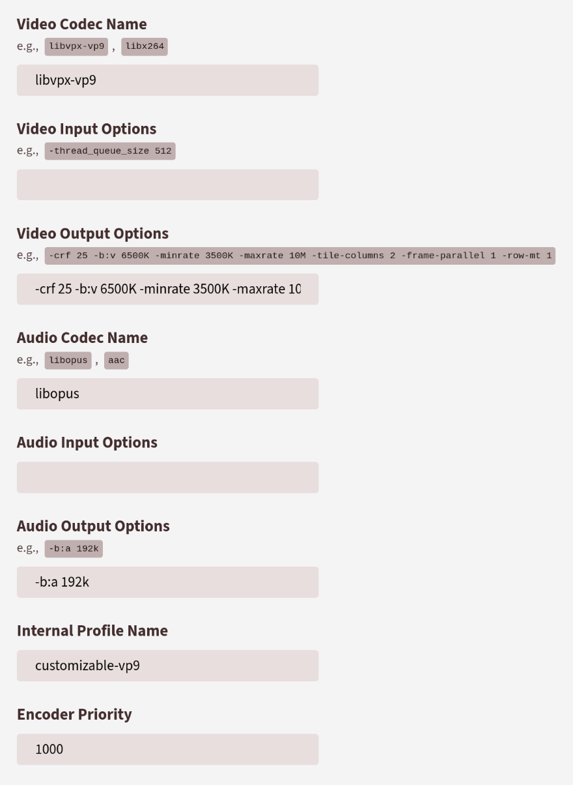

# PeerTube Plugin VP9 Opus Options

Adds a video rendering profile with extensive parameterization capabilities and a choice of different codecs. By default, the `libvpx-vp9` and `libopus` codecs are installed and parameterized. These are modern and more efficient alternatives to the Peertube default encoders (H264 and AAC). However, despite being able to be decoded by virtually all browsers used today, this format can not be read by Safari before Big Sur.

